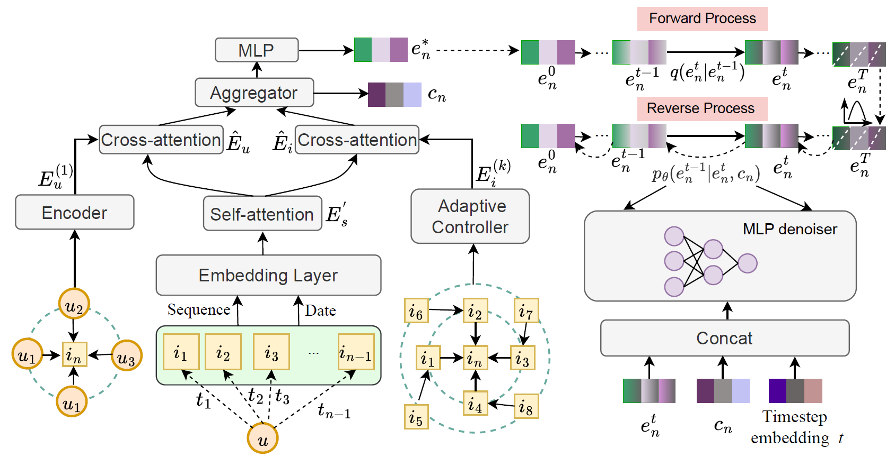

# DCDRec: Collaborative-Guided Diffusion for Sequential Recommendation 

This repository provides the official implementation of DCDRec, a diffusion-based sequential recommendation model that incorporates dual collaborative signals for both target representation learning and conditional denoising.

## Overview

Sequential recommendation aims to predict the next item a user is likely to interact with based on historical behavior sequences. While recent diffusion-based recommendation models have shown promising generative capability, most existing methods still suffer from two limitations. First, they often transform discrete target items into continuous representations in a way that may not faithfully reflect future user preferences. Second, their conditional guidance is mainly derived from intra-sequence patterns, while inter-sequence collaborative signals are largely underexplored.

To address these issues, we propose DCDRec a Dual Collaborative Signal-Guided Diffusion Recommendation model. Specifically, DCDRec enhances target item representation through a cross-attention based encoder and introduces a dual collaborative signal-guided denoising mechanism by integrating user-side and item-side collaborative information into the conditional generation process.

## Framework



## Highlights

- A diffusion-based sequential recommendation framework with dual collaborative guidance.
- A cross-attention based encoder for learning context-aware target item representations.
- A conditional denoising mechanism that incorporates both user-side and item-side collaborative signals.

## Repository Structure

```text
.
├── main.py
├── model.py
├── trainer.py
├── utils.py
├── datasets/
│   ├── Toys/
│   │   ├── train_data_date.pkl
│   │   ├── val_data_date.pkl
│   │   ├── test_data_date.pkl
│   │   ├── user_vocab_size_date.pkl
│   │   └── movie_vocab_size_date.pkl
│   ├── Music/
│   ├── Video/
│   ├── ML1M/
│   ├── ML10M/
│   └── Yelp/
└── figs/
    └── Framework.png
```

### File Description

- `main.py`: entry point for training and evaluation
- `model.py`: implementation of the DCDRec model
- `trainer.py`: training, validation, and testing procedures
- `utils.py`: data loading utilities and helper functions

## Requirements

```bash
pip install -r requirements.txt
```

## Dataset Preparation

```text
datasets/
├── Toys/
├── Music/
├── Video/
├── ML1M/
├── ML10M/
└── Yelp/
```

Each dataset folder should contain:

- train_data_date.pkl
- val_data_date.pkl
- test_data_date.pkl
- user_vocab_size_date.pkl
- movie_vocab_size_date.pkl

## Training

```bash
python main.py --dataset Toys
```

Supported datasets:

- Toys
- Music
- Video
- ML1M
- ML10M
- Yelp

## Output

Logs are saved to:

```
log/{dataset}.txt
```

Best model checkpoint:

```
log/{dataset}_best.pt
```

## Datasets

| Dataset | Users | Items | Interactions | Avg. Sequence Length | Sparsity |
| :---: | :---: | :---: | :---: | :---: | :---: |
| Toys | 16362 | 22431 | 376278 | 7.39 | 0.9990 |
| Music | 9906 | 12381 | 346525 | 14.23 | 0.9971 |
| Video | 10194 | 32349 | 140928 | 24.68 | 0.9989 |
| ML-1M | 6040 | 3633 | 1000209 | 165.60 | 0.9544 |
| ML-10M | 69878 | 10583 | 10000054 | 143.11 | 0.9865 |
| Yelp | 21097 | 20205 | 354764 | 16.82 | 0.9991 |

## License

MIT License

## Data Usage

Datasets are provided for research purposes only.
